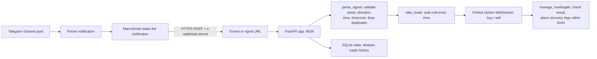

# Pocket Option Signal Bot

Receives binary-options trading signals from a Telegram channel (via MacroDroid or a direct
Telegram listener), parses them, and places trades on Pocket Option through an async broker
client. Includes a local dashboard, martingale recovery with hard risk limits, and webhook
authentication.

> **Risk warning.** Binary options are high risk and are restricted or prohibited for retail
> clients in several jurisdictions (for example, ESMA prohibits them for EU retail clients).
> Automated martingale trading can lose money quickly. Verify that this activity is legal where
> you live, that your broker permits it, and that you accept the risk of loss. Nothing here is
> financial advice. Run in demo mode until the full path is verified.

---

## Contents

- [How it works](#how-it-works)
- [Project layout](#project-layout)
- [Requirements](#requirements)
- [Install](#install)
- [Configuration](#configuration)
- [Capturing the Pocket Option session](#capturing-the-pocket-option-session)
- [Running in development](#running-in-development)
- [Running as a service (survives restarts)](#running-as-a-service-survives-restarts)
- [Webhook transport (stable public URL)](#webhook-transport-stable-public-url)
- [Webhook security](#webhook-security)
- [Risk controls](#risk-controls)
- [HTTP endpoints](#http-endpoints)
- [Testing ingestion](#testing-ingestion)
- [Installation and startup](#installation-and-startup)
- [Troubleshooting](#troubleshooting)
- [Legal](#legal)

---

## How it works



Two ingestion paths exist:

1. **MacroDroid webhook** (default) - MacroDroid reads the Telegram notification on the phone and
   POSTs the text to `POST /trade_signal`.
2. **Direct Telegram listener** (optional) - a Telegram *user* session reads the channel directly,
   so the phone is not required. A bot cannot be used here because a bot cannot read a channel the
   account only subscribes to.

Both paths feed the same parser and the same trade coordinator.

---

## Project layout

| Path | Purpose |
| --- | --- |
| `main.py` | FastAPI app: lifecycle, endpoints, signal validation, trade lifecycle, martingale, risk limits, webhook auth. |
| `parse_data.py` | Parses the signal text shared by MacroDroid and Telegram. Normalises `BUY`/`CALL` to `CALL` and `SELL`/`PUT` to `PUT`. |
| `playwright_scraper.py` | Captures the Pocket Option session (`ssid`) by attaching to a headed Edge profile. Run once, refresh when the session expires. |
| `telegram_listener.py` | Optional direct Telegram channel listener (MTProto user session). Reads every channel in `channels.json`. |
| `telegram_login.py` | Interactive login that creates the Telegram session file. Also called automatically by `fetch_channels.py`. |
| `fetch_channels.py` | Lists the channels the account can read and can append them to `channels.json`. |
| `test.py` | Interactive helper that posts a synthetic signal to `POST /trade_signal`. |
| `ui/` | Static dashboard (`index.html`, `script.js`, `styles.css`), plus `fonts/` (self-hosted Archivo and IBM Plex Mono, so the desk renders offline) and `favicon.svg`. |
| `Macrodroid/MacroDroid.mdr` | MacroDroid export containing the macros, variables, and widgets. |
| `Macrodroid/README.md` | MacroDroid import and configuration guide. |
| `.env.example` | Configuration template. Copy to `.env`. |
| `pyproject.toml` / `uv.lock` | Dependencies and pinned versions. |

---

## Requirements

- Python 3.13+
- [uv](https://docs.astral.sh/uv/) (recommended) or pip
- Microsoft Edge (only needed to capture or refresh the Pocket Option session)
- A tunnel that provides a **stable** public URL (see [Webhook transport](#webhook-transport-stable-public-url))
- A Pocket Option account and an Android phone running MacroDroid, unless you use the direct Telegram listener

---

## Install

### Linux

```bash
uv sync
cp .env.example .env
```

### Windows (PowerShell)

```powershell
uv sync
Copy-Item .env.example .env
```

`uv sync` uses `pyproject.toml` and `uv.lock`, so installs are reproducible. If you prefer pip:

```bash
pip install -r requirements.txt
```

---

## Configuration

Application settings live in `.env`. Never commit that file; it holds your broker session.
Channel IDs and per-channel timezones live in `channels.json` instead, so the same list can be
copied to another host without touching `.env`.

| Key | Required | Description |
| --- | --- | --- |
| `ssid` | Yes | Pocket Option session string. Captured by `playwright_scraper.py`. Expires, and must be refreshed. |
| `WEBHOOK_SECRET` | Yes when exposed | Shared secret required by `POST /trade_signal`. |
| `WEBHOOK_SECRET_AUTOGENERATE` | No | `true` generates `WEBHOOK_SECRET` once on first start and saves it to `.env` with mode `0600`. |
| `WEBHOOK_SECRET_PREVIOUS` | No | Old secret accepted during a rotation window. |
| `TELEGRAM_LISTENER_ENABLED` | No | `true` enables the direct Telegram listener instead of MacroDroid. |
| `TELEGRAM_API_ID` / `TELEGRAM_API_HASH` | If listener enabled | From `my.telegram.org`. |
| `TELEGRAM_CHANNELS_FILE` | No | JSON file listing the channels to read. Default `channels.json`. |
| `TELEGRAM_SESSION_PATH` | No | Telegram session file location. Default `data/telegram_signal_bot`. |
| `TELEGRAM_SIGNAL_PROVIDER` | No | Default provider label when a channel does not set one. Default `telegram`. |
| `SIGNAL_TIMEZONE` | No | Default timezone when a channel does not set one. Default `Etc/GMT-2`. |
| `SIGNAL_BOT_STATE_PATH` | No | SQLite file used for message deduplication. Default `data/signal_bot.sqlite3`. |
| `EDGE_BINARY` | No | Path to the Edge binary, if auto-detection fails. |
| `POCKETOPTION_PLAYWRIGHT_PROFILE` | No | Persistent Edge profile used for session capture. |
| `MARTINGALE_ENABLED` | No | `false` disables recovery trades after a loss. |
| `MAX_TRADE_AMOUNT` | No | Hard cap on a single trade amount. |
| `MAX_SEQUENCE_EXPOSURE` | No | Worst-case total risked across an entire martingale sequence. |
| `MAX_OPEN_TRADES` | No | Maximum concurrent open trades. |
| `MIN_BALANCE_RESERVE` | No | Balance floor that must remain after placing a new sequence's first trade. |

Risk values may also be updated at runtime through `POST /set_risk_management`.

### Channel list (`channels.json`)

```json
{
  "channels": [
    {"name": "primary", "channel": "-1003559202666", "timezone": "Etc/GMT-2",
     "provider": "telegram", "enabled": true},
    {"channel": "@another_channel", "timezone": "Etc/GMT+4"}
  ]
}
```

| Field | Required | Description |
| --- | --- | --- |
| `channel` | Yes | Numeric id (`-100…`) or username (`@name`). |
| `timezone` | No | The offset that channel posts in, as an `Etc/GMT` name. Falls back to `SIGNAL_TIMEZONE`. |
| `provider` | No | Provider label for that channel's signals. Falls back to `TELEGRAM_SIGNAL_PROVIDER`. |
| `name` | No | Friendly label used in logs, `/health`, and deduplication. Defaults to `channel`. |
| `enabled` | No | `false` skips the channel. Default `true`. |

Only `Etc/GMT` offsets are accepted (`Etc/GMT-14` = GMT+14 through `Etc/GMT+12` = GMT-12). The
signal parser reads the numeric offset from the end of the string, so a named zone such as
`Europe/Berlin` is rejected at load rather than failing on every signal. Remember the inversion:
`Etc/GMT-2` means **GMT+2**.

All channels share one Telegram session and are polled by a single client. Add as many entries as
you like — the file is plain text and contains no secrets, so it can be version-controlled or copied
to another host. Set `TELEGRAM_CHANNELS_FILE` to keep it somewhere else. If the file is missing, the
legacy `TELEGRAM_SOURCE_CHANNEL` / `SIGNAL_TIMEZONE` / `TELEGRAM_SIGNAL_PROVIDER` variables are used
exactly as before.

Entries are validated as they load. A `timezone` that pytz does not recognise, an entry with no
`channel`, or the same channel listed twice is **skipped and logged at startup**, and reported under
`telegram_channel_problems` in `GET /health`. The bot keeps running and the other channels keep
working, and a mistyped timezone can never cause a trade at the wrong time. A file that cannot be
parsed at all (bad JSON) is still a hard error.

### Finding channel ids

`fetch_channels.py` lists every channel the Telegram account can read, so you never have to guess an
id. It runs the login from `telegram_login.py` automatically when no authorized session exists yet:

```bash
python fetch_channels.py                  # table of all channels and groups
python fetch_channels.py --search gold    # filter by title, @username or id
python fetch_channels.py --only channel   # skip groups
python fetch_channels.py --timezone-hints # suggest a timezone from recent posts
python fetch_channels.py --json           # machine-readable output
```

The leftmost column marks channels already in `channels.json` (`X`) and new ones (`.`). Copy an id
straight into the file, or let the script do it:

```bash
python fetch_channels.py --write            # append new entries, disabled
python fetch_channels.py --write --enable   # ... and enable them at once
```

`--write` only ever adds entries; existing ones are never modified or removed, and new entries are
saved with `enabled: false` unless you pass `--enable`, so nothing starts trading until you review it.

Timezones cannot be detected reliably, so `--timezone-hints` optionally scans recent posts for
`GMT+N` / `UTC+N` mentions and suggests the matching (inverted) `Etc/GMT-N` value. Treat the hint as a
starting point and confirm it before enabling the channel — a wrong timezone shifts every entry time.

Both scripts print progress to stderr, so `--json` can be piped safely. `TELEGRAM_CONNECT_TIMEOUT`
(default `30` seconds) bounds the initial connection attempt.

### Editing channels from the dashboard

The **Signal channels** panel on the dashboard lists every stored entry and edits the same file, so the
CLI and the UI never disagree. Each row shows its state, the offset in the form the channel posts in,
the provider label, and the last message id the listener has seen.

- **Add channel** opens a sheet for the id, label, provider, timezone and on/off state.
- **Edit** re-opens that sheet; **Delete** lives inside it and asks once.
- **Pause** / **Resume** flips `enabled` without touching the other fields.

Every change saves the whole list and then reloads the Telegram listener in place, so nothing needs
restarting. Saving is validated first and written atomically: a rejected save changes nothing on disk,
and a half-written file can never be read. Entries that do not parse are kept and shown in red with
the reason, instead of disappearing on the next save — the listener skips them in the meantime.

`POST /set_channels` is not authenticated, exactly like the existing `POST /set_risk_management`. The
dashboard binds to `127.0.0.1`; if you expose it through a tunnel, put it behind an authenticating
proxy rather than opening it to the internet.

---

## Capturing the Pocket Option session

The broker client authenticates with an `ssid`, which is derived from an authenticated browser
session. Pocket Option blocks scripted login, so you log in **manually once** in a dedicated Edge
profile and the script captures the session from the live browser.

```bash
uv run python playwright_scraper.py --account-type DEMO --timeout 120
```

1. A headed Edge window opens with a persistent profile under `data/pocketoption-playwright`.
2. Log in to Pocket Option manually and open the cabinet.
3. The script captures the session and writes `ssid`, `UID`, and `ACCOUNT_TYPE` to `.env`.

Notes:

- Use `--account-type DEMO` first. Verify the whole path before switching to `REAL`.
- The session expires. Re-run this command to refresh it.
- Never share or commit the `ssid`, the Edge profile, or the Telegram session file.

---

## Running in development

```bash
uv run uvicorn main:app --host 127.0.0.1 --port 9634
```

Dashboard: `http://127.0.0.1:9634/ui/`
Health: `http://127.0.0.1:9634/health`

If `ssid` is missing or the broker rejects the connection, the app still starts in a degraded mode
with trading disabled, and `/health` reports `broker_connected: false`. This is intentional: the app
never blocks on interactive input, so a service manager restart cannot hang it.

---

## Running as a service (survives restarts)

Two processes must survive reboots: the app and the tunnel. Bind the app to `127.0.0.1` so nothing
is exposed except through the tunnel.

### Linux (systemd)

Create `/etc/systemd/system/signalbot.service`:

```ini
[Unit]
Description=Pocket Option signal bot
After=network-online.target
Wants=network-online.target

[Service]
WorkingDirectory=/home/crazy4electrons/Documents/git-projects/Signal_bot_for_telegram-main
ExecStart=/home/crazy4electrons/Documents/git-projects/Signal_bot_for_telegram-main/.venv/bin/uvicorn main:app --host 127.0.0.1 --port 9634
Restart=always
RestartSec=5

[Install]
WantedBy=multi-user.target
```

Create `/etc/systemd/system/ngrok.service` (see [Webhook transport](#webhook-transport-stable-public-url)
for how to obtain the URL and token):

```ini
[Unit]
Description=ngrok tunnel for the signal bot
After=network-online.target signalbot.service
Wants=network-online.target
Requires=signalbot.service

[Service]
Environment=NGROK_AUTHTOKEN=<YOUR_AUTHTOKEN>
ExecStart=/usr/local/bin/ngrok http 9634 --url https://<your-assigned-name>.ngrok-free.app --log stdout
Restart=always
RestartSec=5

[Install]
WantedBy=multi-user.target
```

Enable both (these need root, so run them yourself):

```bash
sudo systemctl daemon-reload
sudo systemctl enable --now signalbot.service ngrok.service
systemctl status signalbot.service ngrok.service
```

Useful commands:

```bash
journalctl -u signalbot -f          # follow app logs
journalctl -u ngrok -f              # follow tunnel logs
sudo systemctl restart signalbot    # restart the app
```

### Linux (systemd --user, no sudo)

If you do not want to install anything system-wide, use per-user services. Ready-made units live in
[`deploy/`](deploy):

```bash
mkdir -p ~/.config/systemd/user
cp deploy/signalbot.service deploy/ngrok.service ~/.config/systemd/user/
systemctl --user daemon-reload
systemctl --user enable --now signalbot.service ngrok.service
systemctl --user status signalbot ngrok
```

Logs and restarts:

```bash
journalctl --user -u signalbot -f     # follow app logs
journalctl --user -u ngrok -f         # follow tunnel logs
systemctl --user restart signalbot    # restart the app
systemctl --user stop signalbot ngrok # stop both
```

By default user services stop when your last login session ends. To keep them running after logout
and to start them at boot without logging in:

```bash
sudo loginctl enable-linger $USER
```

Notes:

- Stop the copies you started by hand first. The dev domain allows one agent session at a time, so a
  second ngrok fails with `ERR_NGROK_334 (endpoint already online)`.
- The ngrok unit has no `Environment=NGROK_AUTHTOKEN=...` line; it reads the token from
  `~/.config/ngrok/ngrok.yml` (set it with `ngrok config add-authtoken ...`).
- Do not use the system units above and the user units at the same time - they fight over port
  `9634` and over the tunnel.

### Windows

`uvicorn` and `ngrok` are both console applications, so use a service wrapper. Two common options:

#### Option A - NSSM (recommended)

Install NSSM (`winget install NSSM.NSSM` or from nssm.cc), then in an **Administrator** PowerShell:

```powershell
$dir = "C:\signal-bot"

nssm install SignalBot "$dir\.venv\Scripts\uvicorn.exe"
nssm set SignalBot AppDirectory $dir
nssm set SignalBot AppParameters "main:app --host 127.0.0.1 --port 9634"
nssm set SignalBot Start SERVICE_AUTO_START
nssm set SignalBot AppStdout "$dir\logs\signalbot.log"
nssm set SignalBot AppStderr "$dir\logs\signalbot-error.log"
nssm set SignalBot AppExit Default Restart
nssm set SignalBot AppRestartDelay 5000
New-Item -ItemType Directory -Force "$dir\logs" | Out-Null
Start-Service SignalBot
```

For the tunnel, ngrok can install itself as a native service using a config file. Create
`C:\signal-bot\ngrok.yml`:

```yaml
version: "3"
authtoken: <YOUR_AUTHTOKEN>
endpoints:
  - name: signalbot
    url: https://<your-assigned-name>.ngrok-free.app
    upstream:
      url: http://127.0.0.1:9634
```

Then:

```powershell
ngrok service install --config C:\signal-bot\ngrok.yml
ngrok service start
ngrok service status
```

This registers a Windows service that starts on boot and restarts after crashes. Do not move or
delete the ngrok binary or the config file afterwards.

#### Option B - Task Scheduler

If you prefer no third-party wrapper, create a task that runs at startup:

```powershell
$dir = "C:\signal-bot"
$action  = New-ScheduledTaskAction -Execute "$dir\.venv\Scripts\uvicorn.exe" `
           -Argument "main:app --host 127.0.0.1 --port 9634" -WorkingDirectory $dir
$trigger = New-ScheduledTaskTrigger -AtStartup
$settings = New-ScheduledTaskSettingsSet -RestartCount 999 -RestartInterval (New-TimeSpan -Minutes 1) `
            -AllowStartIfOnBatteries -DontStopIfGoingOnBatteries -ExecutionTimeLimit ([TimeSpan]::Zero)

Register-ScheduledTask -TaskName "SignalBot" -Action $action -Trigger $trigger `
  -Settings $settings -RunLevel Highest -User "SYSTEM"
```

Do the same for ngrok with `-Execute "C:\path\to\ngrok.exe" -Argument "http 9634 --url https://<your-assigned-name>.ngrok-free.app"`.

#### Verify on Windows

```powershell
Get-Service SignalBot
Get-ScheduledTask -TaskName SignalBot   # if using Option B
Invoke-RestMethod http://127.0.0.1:9634/health
```

### Why the app must not prompt

Startup never asks for input. Earlier versions prompted for risk settings with `input()`, which
would hang forever under a service manager because there is no stdin. Risk settings now come from
`.env` or from `POST /set_risk_management`.

---

## Webhook transport (stable public URL)

MacroDroid must reach `POST /trade_signal` from the phone, and the URL must stay identical across
restarts - otherwise you must edit the MacroDroid variable every time.

| Option | Stable URL | Needs a domain | Phone app required | Latency |
| --- | --- | --- | --- | --- |
| **ngrok free dev domain** | Yes (tied to your account) | No | No | Immediate |
| Cloudflare Worker + D1 relay | Yes (`workers.dev`) | No | No | 3-5 s (polling) |
| Tailscale Serve | Yes (`*.ts.net`) | No | Yes - must stay connected | Immediate |
| Cloudflare Tunnel | Yes | **Yes** | No | Immediate |

### ngrok (recommended)

The free plan includes one automatically assigned dev domain such as
`https://<your-assigned-name>.ngrok-free.app`, tied to your account, so it persists across restarts.
Find it in the ngrok dashboard under **Domains**.

```bash
ngrok config add-authtoken <YOUR_AUTHTOKEN>
ngrok http 9634 --url https://<your-assigned-name>.ngrok-free.app
```

Notes:

- ngrok agent **v3 is required**. The discontinued v2 agent has no dev-domain support.
- The v2 flags `--subdomain` and `--domain` are deprecated; use `--url`.
- On the free tier you cannot choose the domain name; it is assigned to your account.
- Free quota is 20,000 HTTP requests/month. Signal pushes are far below this, but never point a
  polling loop at the tunnel.
- The free browser interstitial affects only HTML traffic and does not affect programmatic API
  requests. You can still send `ngrok-skip-browser-warning: 1` to be explicit.

Then set the MacroDroid variable `tunnel_url` to
`https://<your-assigned-name>.ngrok-free.app/trade_signal`.

### Other options

- **Cloudflare Worker + D1 relay** - the phone POSTs to a `workers.dev` URL and the app polls
  outbound. No public endpoint on your machine at all, at the cost of added latency and more code.
- **Tailscale Serve** - stable `<machine>.<tailnet>.ts.net` URL with no domain, but the Tailscale app
  must stay connected on the phone. `tailscale funnel` publishes to the public internet; `serve`
  is tailnet-only.
- **Cloudflare Tunnel** - outbound-only and very reliable, but a named tunnel requires a domain
  onboarded to Cloudflare.

---

## Webhook security

Any tunnel URL is reachable from the public internet. Without authentication, anyone who learns the
URL can trigger a trade.

```text
x-webhook-secret: <your secret>
```

- The secret is compared in constant time, and the check runs before body parsing, broker calls,
  drawdown checks, and trade scheduling.
- A missing or incorrect secret returns `401`.
- If `WEBHOOK_SECRET` is unset, the endpoint still accepts requests so local development works, but
  it logs a warning on every request and `/health` reports `webhook_auth_configured: false`.
  Never expose the endpoint in that state.

### Generating the secret

Set `WEBHOOK_SECRET_AUTOGENERATE=true` and the app creates a secret on first start with none
configured, writes it to `.env` (mode `0600`), and logs it once.

The secret is generated **once, not on every start**. Rotating on each startup would invalidate the
value stored in MacroDroid and reject every signal until you updated the phone by hand - and with
`Restart=always` a crash loop would rotate it faster than you could keep up.

To generate a value manually:

```bash
python -c "import secrets; print(secrets.token_urlsafe(32))"
```

### Rotating safely

1. Set `WEBHOOK_SECRET=<new>`.
2. Set `WEBHOOK_SECRET_PREVIOUS=<old>`.
3. Restart - both values are accepted, so no signals are lost.
4. Update the MacroDroid variable.
5. Clear `WEBHOOK_SECRET_PREVIOUS` and restart again.

---

## Risk controls

Martingale multiplies the stake after a loss, so an unbounded sequence can wipe an account. The app
enforces these limits before every order sent to the broker, and each entry below names its exact
scope:

| Setting | Default | Effect |
| --- | --- | --- |
| `MARTINGALE_ENABLED` | `true` | When `false`, a losing trade ends the sequence instead of recovering. |
| `MAX_TRADE_AMOUNT` | `16` | Rejects any single trade above this amount. |
| `MAX_SEQUENCE_EXPOSURE` | `31` | Rejects a sequence whose worst-case total exceeds this. Computed as the sum of all legs. |
| `MAX_OPEN_TRADES` | `3` | Total concurrent sequences. Signals from different providers or different assets can run at the same time up to this cap. |
| `MAX_OPEN_TRADES_PER_ASSET` | `1` | Concurrent sequences on the same asset. `0` disables the check. |
| `MAX_OPEN_TRADES_PER_PROVIDER` | `0` | Concurrent sequences per provider. `0` means unlimited. |
| `STALE_SEQUENCE_SECONDS` | `0` | Age after which a sequence is assumed dead and its slot reclaimed. `0` derives it as `timeframe x (martingale_levels + 1) x 2 + 120`. |
| `MIN_BALANCE_RESERVE` | `0` | Rejects a **new sequence's first trade** that would drop the balance below this floor. Recovery legs are exempt, see below. |
| `drawback_threshold` | `-16` | Halts all signal processing once the daily P/L breaches this floor. |

Worst-case exposure for the defaults (1 initial + 3 recovery levels, multiplier 2) is
`1 + 2 + 4 + 8 = 15`, which is below the `31` ceiling. Raising levels or the multiplier without
raising the ceiling will cause sequences to be rejected rather than sized recklessly.

**Concurrency and exposure.** `MAX_OPEN_TRADES` bounds how many sequences run at once, but each
sequence can still reach the full `MAX_SEQUENCE_EXPOSURE`. With the defaults, 3 concurrent sequences
represent up to `3 x 15 = 45` of potential exposure, which can exceed a small account. Set
`MIN_BALANCE_RESERVE` and keep the martingale levels modest so the total stays within the balance
you are willing to risk.

**Why a sequence can be rejected.** The rejection message names the specific limit and lists the
open sequences, for example:

```text
maximum open trades reached (3/3): providerA/EURUSD_otc/CALL, providerB/GBPUSD_otc/CALL
already 1 open trade(s) on EURUSD_otc (max_open_trades_per_asset=1)
```

A recovery leg excludes its own parent trade from these counts, so a martingale step is never
blocked by the trade it is recovering.

**Recovery legs and `MIN_BALANCE_RESERVE`.** The reserve only gates the *first* trade of a new
sequence. A recovery leg is exempt from it, because the parent's loss is already booked: refusing
the recovery would only lock that loss in and abandon the sequence. A recovery leg must still be
affordable, so a stake larger than the current balance is rejected, and `MAX_TRADE_AMOUNT`,
`MARTINGALE_ENABLED` and the open-trade caps all still apply. When a recovery leg is placed below
the reserve, the app logs that it did so.

If a result lookup never returns, the sequence would otherwise hold its slot forever. Two
mechanisms prevent that: a failed sequence releases its slot immediately, and
`purge_stale_sequences()` reclaims any sequence older than `STALE_SEQUENCE_SECONDS` (derived from
the timeframe by default).

---

## HTTP endpoints

| Method | Path | Description |
| --- | --- | --- |
| `GET` | `/` | Serves the dashboard. |
| `GET` | `/ui/` | Static dashboard assets. |
| `GET` | `/health` | Broker connection, Telegram listener state, configured channels, `webhook_auth_configured`, and webhook counters. |
| `POST` | `/trade_signal` | Signal webhook. Requires `x-webhook-secret` when configured. |
| `GET` | `/account_details` | Balance, daily P/L, and lifespan P/L. |
| `GET` | `/open_trades` | Currently open trades. |
| `GET` | `/closed_trades` | Last 10 closed trades. |
| `GET` | `/current_signals` | Signals currently held in memory. |
| `GET` | `/get_risk_management` | Current risk configuration. |
| `POST` | `/set_risk_management` | Updates risk configuration. Accepts zero values. |
| `GET` | `/get_channels` | Channel list as stored, the usable timezone offsets, and the listener's live state. |
| `POST` | `/set_channels` | Replaces the channel list and reloads the listener. Validates the whole list first. |

Example health response:

```json
{
  "status": "ok",
  "broker_connected": true,
  "telegram_listener_enabled": false,
  "telegram_listener_connected": false,
  "telegram_channels": [
    {
      "name": "primary",
      "channel": "-1003559202666",
      "timezone": "Etc/GMT-2",
      "provider": "telegram",
      "last_message_id": 4711
    }
  ],
  "telegram_channel_problems": [],
  "webhook_auth_configured": true,
  "webhook": {
    "last_received_at": "2026-09-14 10:38:14",
    "last_result": "accepted",
    "accepted": 12,
    "rejected": 3,
    "unauthorized": 2
  }
}
```

---

## Testing ingestion

With the app running:

```bash
uv run python test.py
```

It prompts for an asset, direction, provider, port, and timezone, then posts a synthetic signal. It
automatically sends `x-webhook-secret` when `WEBHOOK_SECRET` is set in `.env`. A `401` means the
secret does not match the server value.

Equivalently, from MacroDroid use the `test signal` widget.

Verify:

```bash
curl -s http://127.0.0.1:9634/health
```

`webhook.last_result` should read `accepted`, or `invalid_signal` if the payload did not parse.

---

## Installation and startup

The full path from a fresh checkout to a verified, running bot.

### Prerequisites

- Python 3.13+ (`.python-version` pins `3.13`, `pyproject.toml` requires `>=3.13`)
- [uv](https://docs.astral.sh/uv/) - recommended, so `uv.lock` gives an identical dependency set
- Microsoft Edge - needed once, to capture the Pocket Option session
- ngrok v3 with your authtoken, for the webhook tunnel
- A Pocket Option account, plus an Android phone running MacroDroid unless you use the direct
  Telegram listener

### 1. Install the dependencies

From the project root:

```bash
uv sync
```

`uv.lock` is committed, so this resolves to the same versions every time. The broker library ships
prebuilt wheels for Windows, Linux and macOS on Python 3.13, so no Rust toolchain is required. If
you prefer pip, use the fallback instead: `pip install -r requirements.txt`

### 2. Create the configuration file

```bash
cp .env.example .env        # Windows: Copy-Item .env.example .env
```

At minimum set `WEBHOOK_SECRET` - generate one with
`python -c "import secrets; print(secrets.token_urlsafe(32))"` - and leave `ssid` for the next step.
[Configuration](#configuration) documents every key.

### 3. Capture the Pocket Option session

```bash
uv run python playwright_scraper.py --account-type DEMO --timeout 120
```

A headed Edge window opens. Log in manually, open the cabinet and leave the page open; the script
writes `ssid`, `UID` and `ACCOUNT_TYPE` to `.env`. Start with `DEMO`. See
[Capturing the Pocket Option session](#capturing-the-pocket-option-session) for details.

### 4. Start the app

```bash
uv run uvicorn main:app --host 127.0.0.1 --port 9634
```

Always start from the project root: `.env` and the `data/` paths are resolved relative to it.

- Dashboard: `http://127.0.0.1:9634/ui/`
- Health: `http://127.0.0.1:9634/health`

If `ssid` is missing or the broker rejects it, the app still starts with trading disabled and
`/health` reports `broker_connected: false`. This is intentional, so a service manager restart
cannot hang on input.

### 5. Expose the webhook

```bash
ngrok http 9634 --url https://<your-assigned-name>.ngrok-free.app
```

Keep this URL stable across restarts, then point the MacroDroid `tunnel_url` variable at
`https://<your-assigned-name>.ngrok-free.app/trade_signal`. See
[Webhook transport](#webhook-transport-stable-public-url) for the alternatives.

### 6. Verify

```bash
uv run python test.py                        # posts a synthetic signal
curl -s http://127.0.0.1:9634/health
```

`webhook.last_result` should read `accepted`. A `401` means the secret does not match; a `503` means
the broker is not connected.

### Notes

- **Windows: set `EDGE_BINARY`.** `playwright_scraper.py` only probes the Linux Edge binary names
  (`microsoft-edge-stable`, `microsoft-edge`), so step 3 fails with *"Microsoft Edge was not found"*
  unless you point it at the executable, for example
  `EDGE_BINARY=C:\Program Files (x86)\Microsoft\Edge\Application\msedge.exe`.
- **`playwright install` is not required.** The scraper passes `executable_path` and drives your
  installed Edge.
- **Timezone is inverted in pytz.** `SIGNAL_TIMEZONE`, a channel's `timezone`, and the MacroDroid
  `timezone` variable use the flipped offset: `Etc/GMT-2` means **GMT+2**. Getting it wrong shifts
  every entry time.
- **Never commit `.env`.** It holds a live broker session.

---

## Troubleshooting

| Symptom | Cause | Fix |
| --- | --- | --- |
| `401` from `/trade_signal` | Secret mismatch or missing header | Ensure both sides use the same value and the header is named `x-webhook-secret`. |
| `503` from `/trade_signal` | Broker not connected | Check `/health` for `broker_connected`. Re-capture `ssid`. |
| `403` from `/trade_signal` | Daily loss breached `drawback_threshold` | Expected safety halt. Adjust the threshold deliberately if intended. |
| Signals never arrive | Tunnel URL changed after restart | Use a tunnel with a stable URL; check `webhook.last_received_at`. |
| `broker_connected: false` after restart | `ssid` expired | Re-run `playwright_scraper.py`. |
| Trades not placed but signals accepted | Signal arrived after its entry time | Signals are rejected as late. Check the timing and the timezone. |
| Service will not start on Linux | Wrong path in the unit file | Confirm `WorkingDirectory` and `ExecStart` point at the actual venv. |
| Service will not start on Windows | NSSM paths or permissions | Verify the venv path and check `logs\signalbot-error.log`. |
| Scraper says "Microsoft Edge was not found" | Edge is not on `PATH` (normal on Windows) | Set `EDGE_BINARY` in `.env`; see [Installation and startup](#installation-and-startup). |
| ngrok error `ERR_NGROK_313` | Tried a custom subdomain on the free plan | Use your assigned dev domain, or upgrade. |
| ngrok error about unsupported version | Using v2 | Upgrade to ngrok agent v3. |

---

## Legal

Trading binary options carries a high risk of losing money rapidly. Automated martingale strategies
can amplify losses. Binary options are restricted or prohibited for retail clients in multiple
jurisdictions. Check the rules that apply to you and your broker's terms of service before trading
with real funds. This project is provided under the MIT license without warranty of any kind.

**license: MIT**
